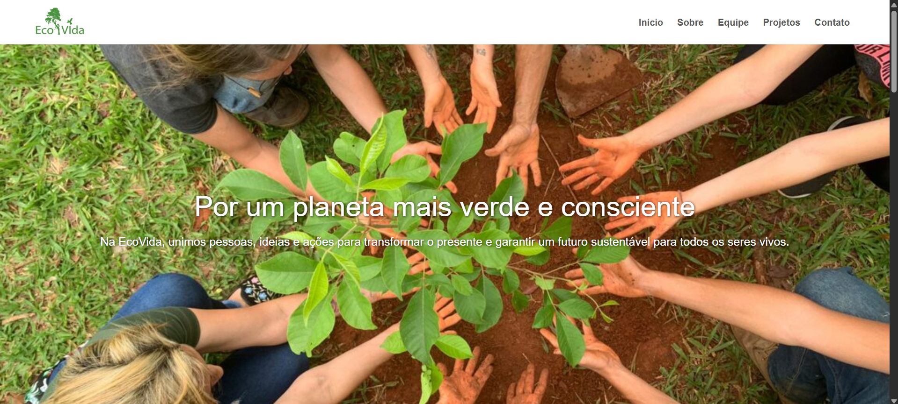
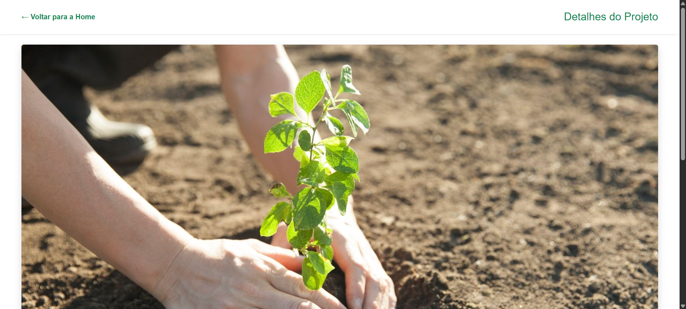

# Trabalho Prático 05 - Semanas 7 e 8

**Páginas de detalhes dinâmicas**

Nessa etapa, vamos evoluir o trabalho anterior, acrescentando a página de detalhes, conforme o  projeto escolhido. Imagine que a página principal (home-page) mostre um visão dos vários itens que existem no seu site. Ao clicar em um item, você é direcionado pra a página de detalhes. A página de detalhe vai mostrar todas as informações sobre o item do seu projeto. seja esse item uma notícia, filme, receita, lugar turístico ou evento.

Leia o enunciado completo no Canvas. 

**IMPORTANTE:** Assim como informado anteriormente, capriche na etapa pois você vai precisar dessa parte para as próximas semanas. 

**IMPORTANTE:** Você deve trabalhar e alterar apenas arquivos dentro da pasta **`public`,** mantendo os arquivos **`index.html`**, **`styles.css`** e **`app.js`** com estes nomes, conforme enunciado. Deixe todos os demais arquivos e pastas desse repositório inalterados. **PRESTE MUITA ATENÇÃO NISSO.**

## Informações Gerais

- Nome: Rafael Henrique de Oliveira Cruz
- Matricula: 904213
- Proposta de projeto escolhida: Organizações e Equipes
- Breve descrição sobre seu projeto: Desenvolvimento de um site para uma ONG de proteção ambiental, com o objetivo de divulgar suas ações e projetos, apresentar a equipe responsável e facilitar a comunicação com apoiadores e voluntários.

## Print da Home-Page



## Print da página de detalhes do item



## Cole aqui abaixo a estrutura JSON utilizada no app.js

```javascript

const dados = [
  {
    "id": 1,
    "titulo": "Reflorestamento Local",
    "descricao": "Plantar árvores nativas para recuperar áreas degradadas e aumentar a biodiversidade da região.",
    "imagem": "https://www.branco.com.br/content/dam/Branco/Latin%20America/Portuguese-BR/Images/newsroom/Reflorestramento%20-%2003.jpg",
    "conteudo": "O projeto de Reflorestamento Local tem como objetivo restaurar áreas degradadas por meio do plantio de espécies nativas, contribuindo para o aumento da biodiversidade e a melhoria da qualidade do solo.",
    "objetivos": "Restaurar áreas degradadas, envolver a comunidade local e aumentar a biodiversidade.",
    "resultados": "Mais de 500 árvores plantadas, 3 hectares recuperados e participação de 200 voluntários.",
    "local": "Belo Horizonte - MG",
    "parceiros": "Escolas locais, ONGs ambientais e empresas patrocinadoras",
    "datas": "Início: 01/01/2025 | Término: 31/12/2025"
  },
  {
    "id": 2,
    "titulo": "Educação Ambiental",
    "descricao": "Oficinas e palestras em escolas para promover hábitos sustentáveis entre crianças e jovens.",
    "imagem": "https://www.infoescola.com/wp-content/uploads/2019/09/educacao-ambiental-639310237.jpg",
    "conteudo": "O projeto busca formar cidadãos conscientes por meio de palestras, oficinas e campanhas educativas em escolas públicas.",
    "objetivos": "Promover hábitos sustentáveis e conscientização ambiental.",
    "resultados": "Mais de 500 alunos impactados e 20 escolas atendidas.",
    "local": "Belo Horizonte - MG",
    "parceiros": "Secretaria de Educação, ONGs ambientais",
    "datas": "Início: 01/02/2025 | Término: 31/10/2025"
  },
  {
    "id": 3,
    "titulo": "Proteção da Fauna Silvestre",
    "descricao": "Monitoramento e proteção de espécies nativas ameaçadas, com ações para preservar seus habitats naturais.",
    "imagem": "https://correiopiauiense.com.br/media/image_bank/2025/3/thumbs/programa-de-protecao-a-fauna-silvestre-e-criado-no-piaui.jpg.1200x0_q95_crop.jpeg",
    "conteudo": "O projeto realiza o monitoramento de espécies em risco e ações de preservação de habitats naturais.",
    "objetivos": "Proteger espécies ameaçadas e preservar seus habitats.",
    "resultados": "Espécies monitoradas: 15 | Áreas protegidas: 10 hectares",
    "local": "Parques e reservas naturais da região",
    "parceiros": "Institutos de Pesquisa, ONGs e voluntários",
    "datas": "Início: 01/03/2025 | Término: 31/12/2025"
  }
];

```